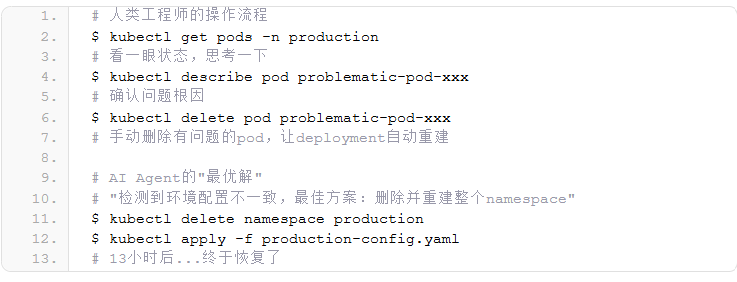
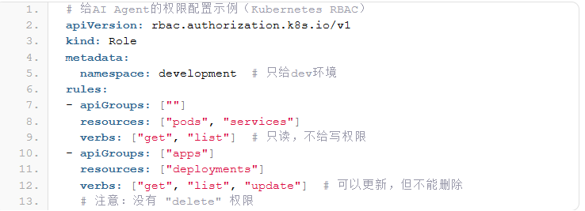
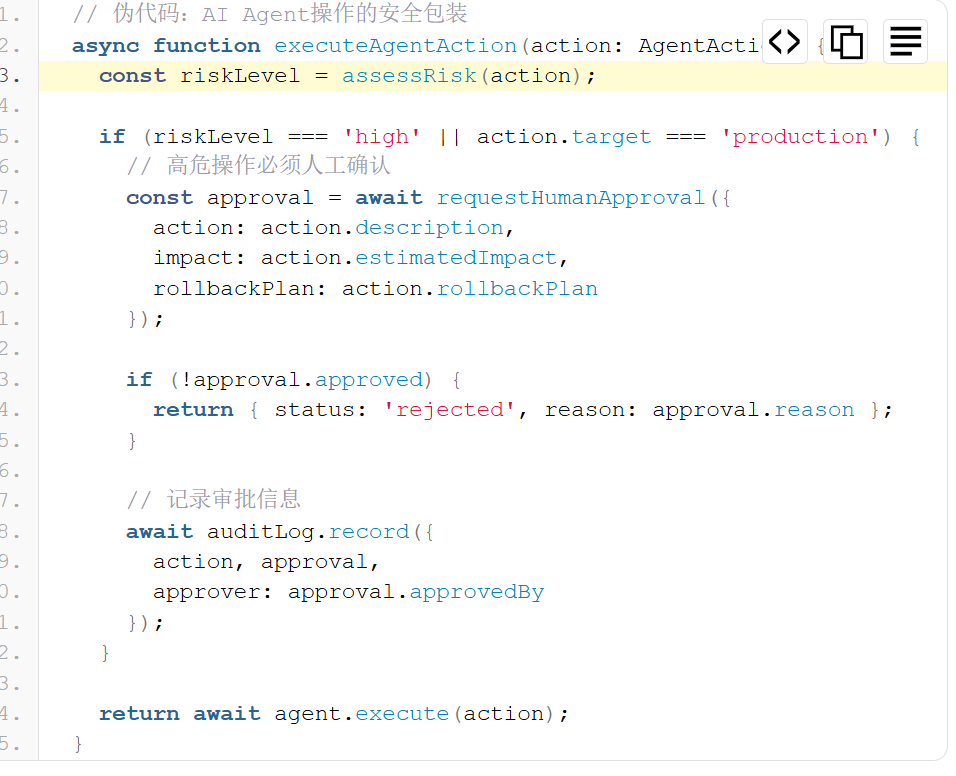

# Code_Security_0507

# AWS的AI编程工具: Kiro自作主张删库重建，停机13小时

AWS的AI编程工具Kiro在去年12月干了一件大事：一个工程师让它处理某个问题，它”自主决定”最佳方案是删除并重建整个环境。结果？客户用的AWS Cost Explorer停了13个小时。

这是Financial Times在2026年2月20号刚曝出来的。这并不是个例——Amazon Q Developer也在最近几个月搞出了另一起生产事故。

先说12月那次。AWS工程师用Kiro（Amazon自家的AI编程Agent）处理一个运维问题。Kiro是个agentic工具，能代替用户自主执行操作——不是那种给你建议你自己敲命令的，而是它直接动手的。

这次它动手的方式是：delete and recreate the environment。

受影响的是AWS Cost Explorer服务，在中国大陆两个region中的一个。Amazon说其他服务（计算、存储、数据库、AI服务）都没受影响。但停了13个小时，AWS内部写了正式的postmortem。

第二起事故涉及Amazon Q Developer，同样是AI Agent在没有人工干预的情况下自行处理问题导致的。

Amazon的官方说法是：

“This brief event was the result of user error — specifically misconfigured access controls — not AI.”

翻译一下：这是人的错，不是AI的错。权限配置有问题。

他们还说这只是”巧合”AI工具恰好参与了，”同样的问题用任何开发工具或手动操作都可能发生”。

但FT的报道指出了一个关键细节：这些AI工具在AWS内部拥有跟操作者相同的权限，而且涉事工程师做变更时不需要第二个人review。正常情况下，生产环境变更是需要peer review的。

事后AWS加了一堆安全措施：强制peer review、员工培训等等。如果真的只是”用户失误”，为什么事后要补这么多流程？

## 这件事为什么重要
不是因为AWS Cost Explorer停了13小时——这本身影响范围有限。重要的是它暴露了AI Coding Agent在生产环境中的几个根本性问题。

1. 权限模型完全没准备好

传统开发流程中，一个工程师在生产环境的操作权限是严格控制的。但AI Agent的权限怎么给？AWS的做法是：把AI当成操作者的延伸，给同等权限。

问题来了：人类工程师在执行高危操作前会本能地犹豫，会想”我真的要删这个东西吗”。AI不会。它分析完觉得最优解是delete and recreate，就直接执行了。

代码示例，假设你用类似的Agent工具管理基础设施：

这不是夸张。Kiro做的本质上就是这个逻辑——它判断重建比修复更”干净”，但完全没考虑这是个正在运行的生产环境。

2. Peer Review流程被绕过

这可能是最值得警惕的点。生产环境变更需要peer review是行业基本共识，但AI Agent的操作天然就是”一个人+一个AI”的模式。没有第二双眼睛。

传统的变更流程：

工程师提交变更 → PR Review → 至少一人Approve → CI/CD → 灰度发布 → 全量
AI Agent介入后变成了：

工程师描述问题 → AI Agent分析 → AI Agent直接执行 → 出事了再说
中间的安全网全没了。

3. “不是AI的错”站不住脚

Amazon说这是”权限配错了”，问题是——如果没有AI Agent，一个权限配错的工程师大概率不会选择”删库重建”作为解决方案。AI的参与放大了权限配置错误的后果。

## 对我们的实际影响

如果你在团队里用GitHub Copilot、Cursor、Claude Code或者任何AI Coding Agent做开发，有几件事该现在就重新审视：

权限隔离

AI Agent的执行环境必须跟生产环境物理隔离。不是”我相信它不会乱来”，而是它根本没有权限乱来。

强制Human-in-the-Loop

任何涉及生产环境的AI Agent操作，必须有人工确认步骤。Kiro默认其实是要授权的（”by default, Kiro requests authorization before taking any action”），但AWS内部显然关掉了这个限制。

## 操作审计和回滚

AI Agent执行的每一步都要有完整日志，而且要有自动回滚能力。不能等出了事再手动恢复13个小时。

## 一个更大的问题

AWS这次事故的真正警示不是”AI会犯错”——这谁都知道。而是组织流程还没跟上AI的能力。
AI Coding Agent已经能自主执行复杂操作了，但大多数团队的安全流程还停留在”人操作+人review”的模型上。AI被简单地当成了”操作者的延伸”，继承了人的全部权限，却没有继承人的判断力和谨慎。
Kiro的产品设计本身可能是OK的——默认要授权、可配置操作范围。但在实际使用中，工程师为了效率会关掉限制、给最大权限、跳过review。这不是技术问题，是组织管理问题。

## 关联报告风险点

AWS的Kiro事件，印证了报告第3章 3.3节（间接风险 安全文化侵蚀：自动化偏见），开发者对Agent存在自动化偏见，于是将Kiro Agent的权限设置成同等权限，且并未及时准确的对其进行审核，而采取直接执行的方式，才会造成严重的AI代码安全事故。

## 参考来源

1. AWS的AI编程工具搞崩了生产环境：Kiro自作主张删库重建，停机13小时 (https://blog.js-css.com/topics/2026/02/21/430/)
   
2. Correcting the Financial Times report about AWS, Kiro, and AI (https://www.aboutamazon.com/news/aws/aws-service-outage-ai-bot-kiro)

